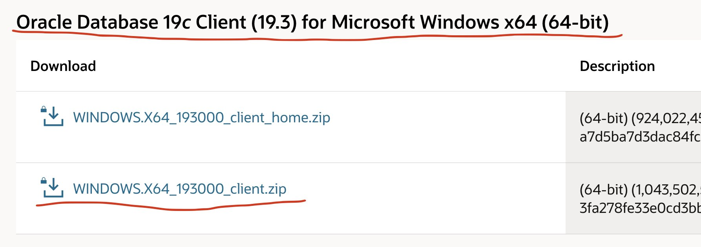
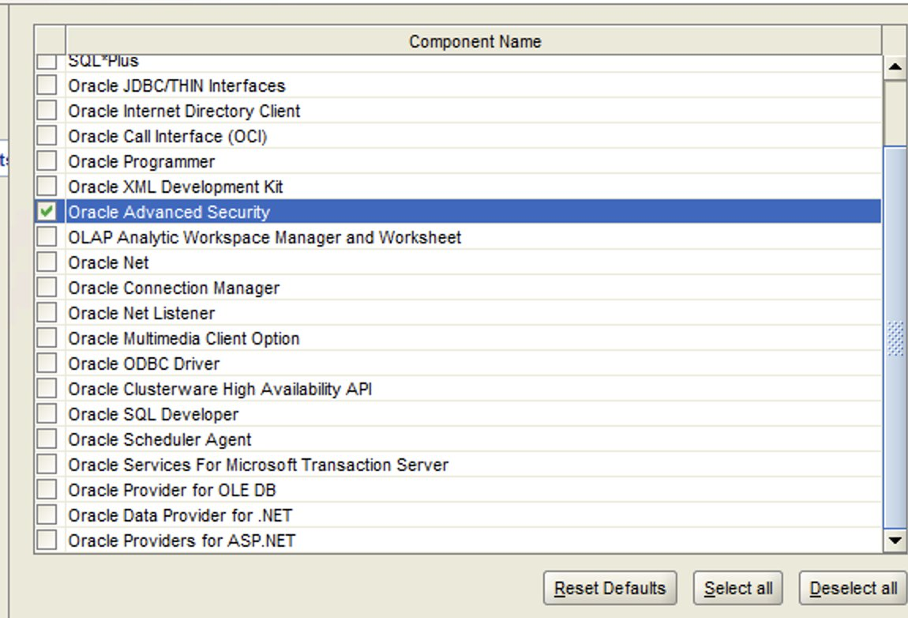
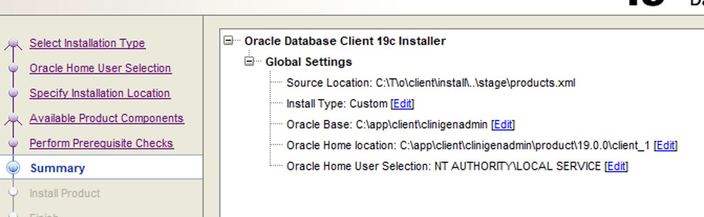
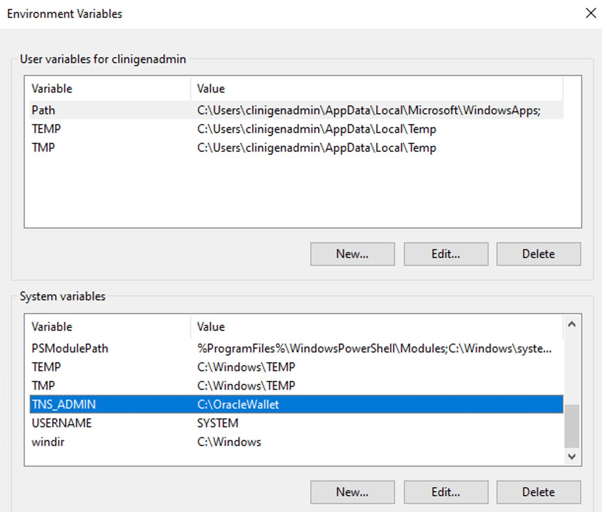
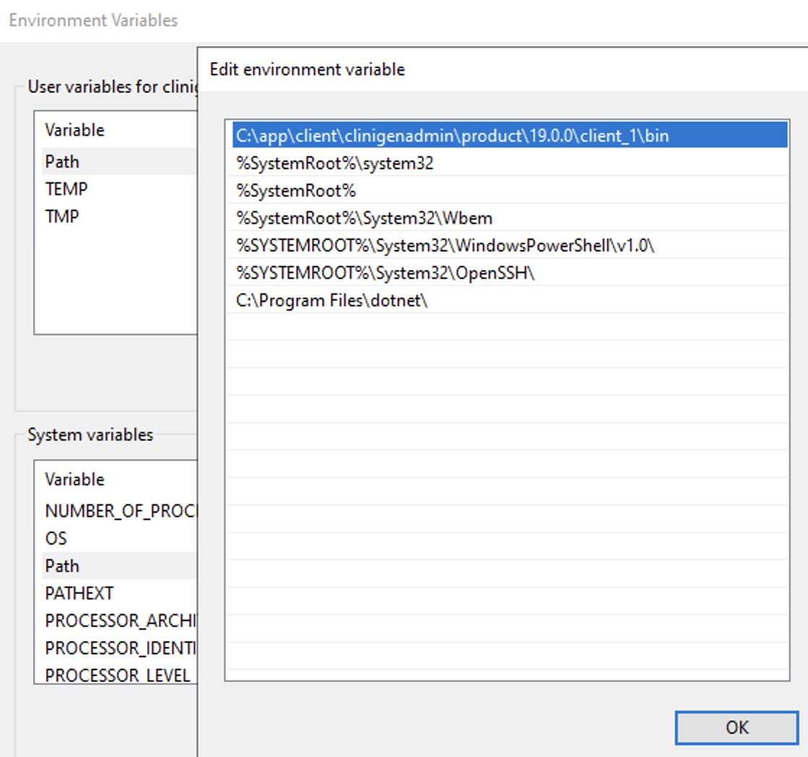
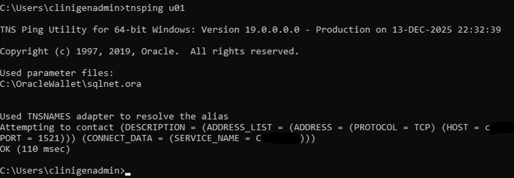
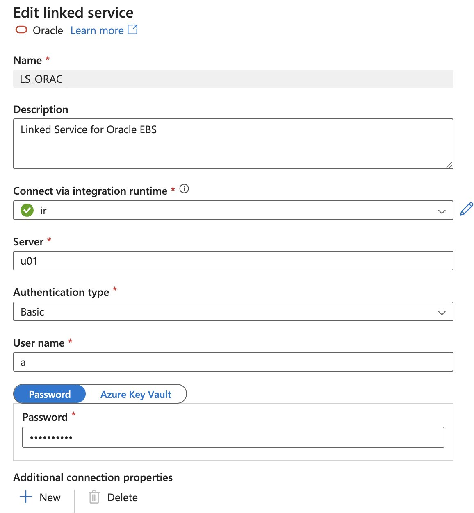

Install Oracle wallet and configure it to use with ADF...
Download Oracle Full client from Oracle web site. This requires to have an Oracle account. It
can be created free of charge.
The full client is required because it contains Oracle Wallet.

Run installation.
Oracle Advanced Security component is the minimum we need.

The summary installation page should look like this.

After the installation is completed create the following system environment variables
Let’s assume this folder will be used for Oracle Wallet - C:\OracleWallet
TNS_ADMIN = C:\OracleWallet

Make sure the Oracle bin folder C:\app\client\clinigenadmin\product\19.0.0\client_1\bin has been added to the default Path environment variable.

Create folder - C:\OracleWallet
Create Oracle wallet in that folder by executing

mkstore -wrl C:\OracleWallet\ -create

This step will require you to create a password.
After that, there will be two new files cwallet.sso and ewallet.p12

Create two more files in the same folder. Here are the examples.

1. SQLNET.
ORA
sqlnet.authentication_services= (NTS)
NAMES.
DIRECTORY_PATH= (TNSNAMES)
SQLNET.WALLET_OVERRIDE = TRUE
SSL_CLIENT_
AUTHENTICATION = FALSE
SSL_VERSION = 0
WALLET_LOCATION =
(SOURCE = (METHOD = FILE)
(METHOD_DATA = (DIRECTORY = C:\OracleWallet)))
2. TNSNAMES.
ORA
u01 =
(DESCRIPTION =
(ADDRESS_LIST =
(ADDRESS = (PROTOCOL = TCP) (HOST = servername.domain.com
) (PORT =
1521))
)
(CONNECT_DATA =
(SERVICE_NAME = servicename)
)
)

By doing this, we define the Oracle wallet location and bind alias u01 to connection string servername.domain.com:1521/servicename 
Create username/password credentials in the wallet by executing
mkstore -wrl C:\OracleWallet\ -createCredential u01 USERNAME PASSW0RD
Test connectivity to Oracle DB by tsnping command

To make sure all the settings are applied, run Microsoft Integration Runtime and STOP and START runtime services.
After that the new alias can be used in ADF instead of the full connection string.
Please note that you still need to enter the same username and password on the ADF side.

